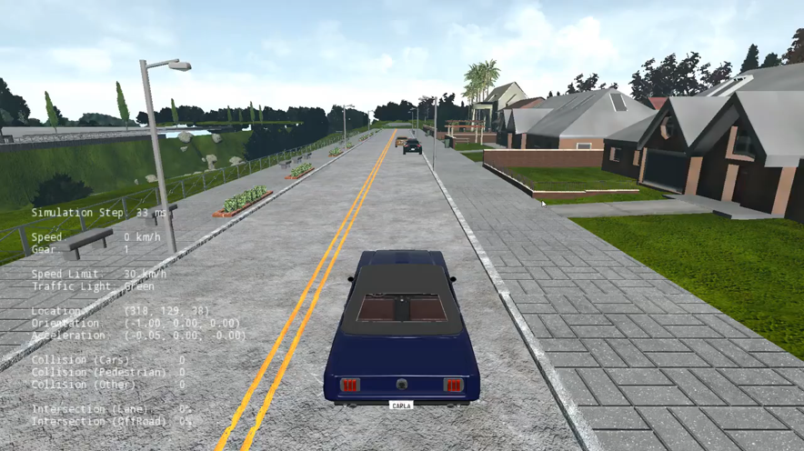

# Autonomous-Vehicle-Motion-Planning-and-Perception

## Content

- Part 1: [Vehicle Control of Self-Driving Cars](./01_introduction_to_self_driving_cars)
  - Summary: Designed and implemented a controller tailored for the CARLA simulator, aiming to guide the vehicle along a predetermined race track. The controller is equipped to manage both longitudinal and lateral control, ensuring the vehicle achieves specified speeds at designated waypoints.Summary: Designed and implemented a controller tailored for the CARLA simulator, aiming to guide the vehicle along a predetermined race track. The controller is equipped to manage both longitudinal and lateral control, ensuring the vehicle achieves specified speeds at designated waypoints.

- Part 2: [State Estimation of Self-Driving Cars](./02_state_estimation_and_localization)
  - Summary: This part was implemented in three sub-parts: In the first part , implemented the Extended Kalman Filter (ES-EKF) by completing the provided code for filter prediction and correction steps. Evaluated the filter's accuracy by comparing estimated vehicle positions with ground truth data. In the second part, analyzed the impact of sensor miscalibration and adjust filter parameters to compensate. In the third part, explorde the effects of sensor dropout on position estimates, highlighting drift and uncertainty changes during measurement unavailability.
  
- Part 3: [Environment Perception for Self-Driving Cars](./03_visual_perception)
  - Summary: This part focuses on leveraging semantic segmentation neural networks to enhance self-driving car capabilities. Key tasks include implementing 3D drivable space estimation, lane estimation, and error filtering in 2D object detection. The integrated approach aims to improve obstacle detection and accurately determine their distance from the self-driving car, contributing to enhanced environmental awareness.

- Part 4: [Integrated Motion Planning for Self-Driving Cars](./04_motion_planning)
  - Summary: This part aims to develop a comprehensive motion planning stack for autonomous vehicles capable of navigating complex environments. It involves implementing behavioral planning logic, static collision checking, path selection, and velocity profile generation to ensure safe and efficient navigation. Key objectives include avoiding static and dynamic obstacles, tracking the lane centerline, and handling stop signs to achieve robust autonomous driving capabilities.

## Certificate

