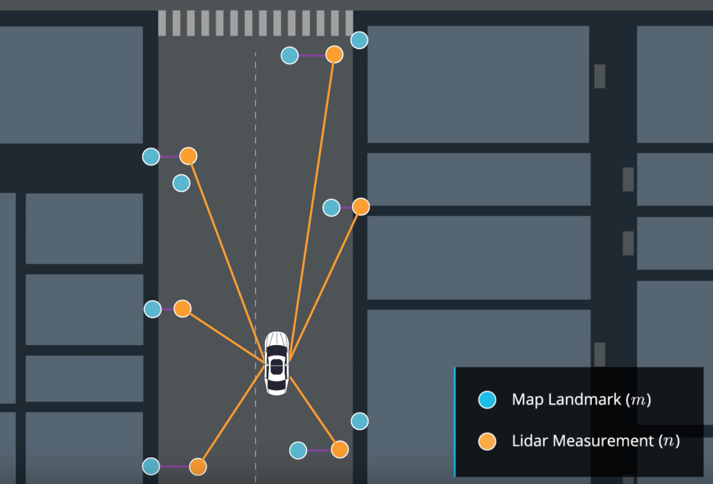

# State Estimation and Localization for Self-Driving Cars

## Linear and Nonlinear Kalman Filters

- Programming Code: [Estimating a Vehicle Trajectory](./Part1/assg_learner.ipynb)
- Submission Files [submission.pkl](./Part1/submission.pkl)
- 

## An Autonomous Vehicle State Estimator

This module combines materials from Modules 1-4 together, with the goal of developing a full vehicle state estimator. Learners will build, using data from the CARLA simulator, an error-state extended Kalman filter-based estimator that incorporates GPS, IMU, and LIDAR measurements to determine the vehicle position and orientation on the road at a high update rate. There will be an opportunity to observe what happens to the quality of the state estimate when one or more of the sensors either 'drop out' or are disabled.

- Final Project: [Vehicle State Estimation on a Roadway](./Part2/final_project)
  - Submission Files [pt1_submission.txt](./Part2/pt1_submission.txt)
  - Submission Files [pt2_submission.txt](./Part2/pt2_submission.txt)
  - Submission Files [pt3_submission.txt](./Part2/pt3_submission.txt)

